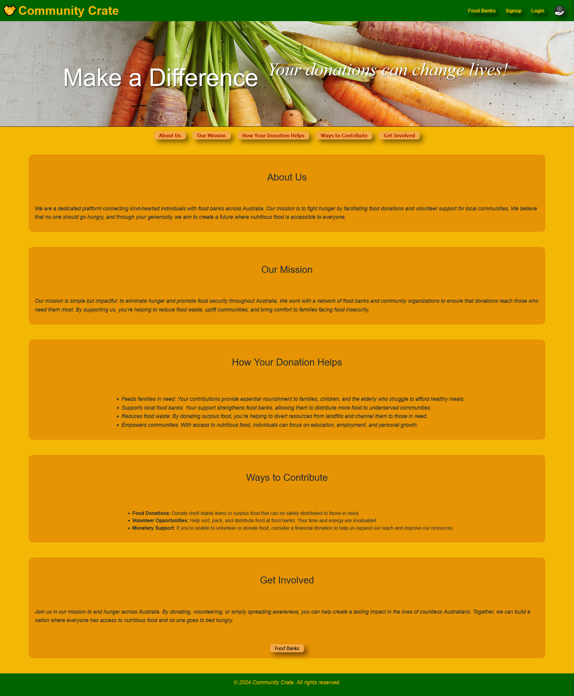
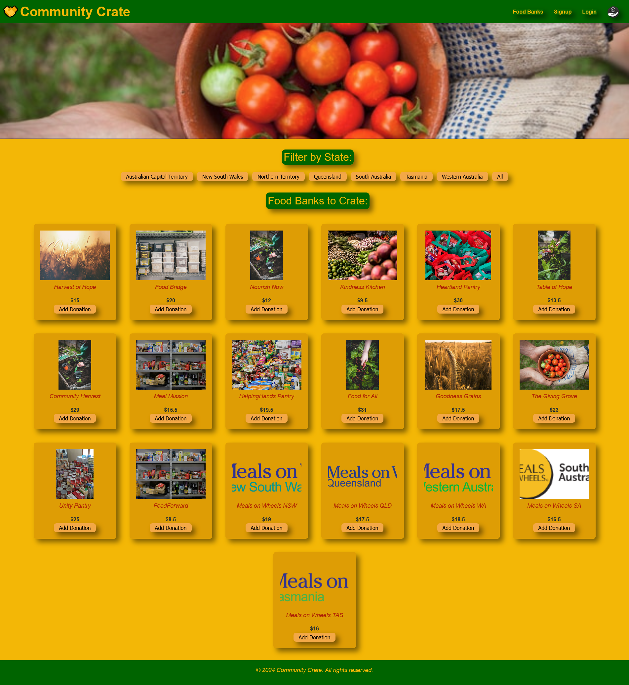

# Community Crate


Welcome to **Community Crate**, a platform designed to help communities connect, collaborate, and share resources effectively. This application aims to facilitate community engagement and streamline the sharing of local resources and information.

Visit the [Community Crate website](https://community-crate.onrender.com/) to learn more about the project and explore the features.

## Table of Contents

- [About the Project](#about-the-project)
- [Features](#features)
- [Getting Started](#getting-started)
- [Usage](#usage)
- [Technologies Used](#technologies-used)
- [Contributing](#contributing)
- [License](#license)
- [Contact](#contact)

## About the Project

Community Crate is a web application designed to enhance community interactions. The application is designed to be user-friendly and intuitive, making it easy for community members to connect, collaborate, and share resources. The key feature of the platform is the ability to donate to multiple organisations in one go, which can be a powerful tool for community engagement and support.

## Features

- **Resource Sharing**: A platform for sharing items, tools, or services within the community.
- **User Profiles**: Personalized user profiles to manage donations and donation history.
- **Donations**: A donation system that allows users to make donations to local organisations.

## Getting Started

To get a local copy of the project up and running, follow the steps below.

### Prerequisites

Make sure you have the following installed:

- Node.js
- MongoDB
- Git

### Installation

1. Clone the repository:

    ```bash
    git clone https://github.com/ChrisReynolds0508/community-crate.git
    cd community-crate
    ```

2. Install the dependencies:

    ```bash
    npm install
    ```

3. Run the application:

    ```bash
    npm start
    ```

4. Visit the application in your browser at `http://localhost:3000`.

## Usage

Once the application is running, users can register, log in, and explore various features of the Community Crate platform. The platform offers a variety of ways to donate to local organisations, including making one-off donations to indiviual food banks, or creating a mass donation to multiple organisations at once.




## Technologies Used

- **Frontend**: React, CSS (Flexbox/Grid)
- **Backend**: Node.js, Express.js
- **Database**: MongoDB
- **Authentication**: JSON Web Token (JWT)
- **API**: RESTful API

## Contributing

We welcome contributions from the community! To contribute:

1. Fork the repository.
2. Create a new branch (`git checkout -b feature/YourFeature`).
3. Commit your changes (`git commit -m 'Add your feature'`).
4. Push to the branch (`git push origin feature/YourFeature`).
5. Open a pull request.

Please make sure to follow the project's coding standards and include relevant tests for your changes.

## License

Distributed under the MIT License. See `LICENSE` for more information.

## Contact

Contributors:

- [Chris Reynolds](https://github.com/ChrisReynolds0508)
- [Sanjeev Thapa](https://github.com/Sanjeev190)
- [Ashley Cowan](https://github.com/Ashley55mv)
- [Alana Hearne](https://github.com/ajhearne-mZAOSW)

GitHub Repository: [Community Crate](https://github.com/ChrisReynolds0508/community-crate)
